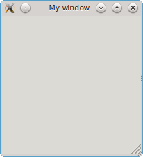
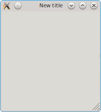
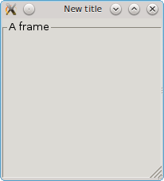
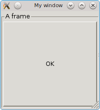
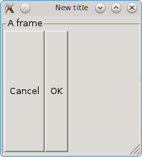
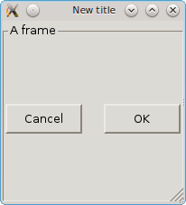
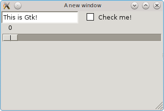
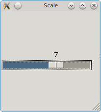
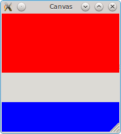
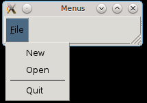

# Julia interface to `Gtk+ 2` and `Gtk+ 3` GUI library

[](http://pkg.julialang.org/?pkg=Gtk&ver=0.3)
[](http://pkg.julialang.org/?pkg=Gtk&ver=0.4)
[](https://travis-ci.org/JuliaGraphics/Gtk.jl)
[](https://coveralls.io/r/JuliaGraphics/Gtk.jl)

GUI building, using the Gtk library: [http://www.gtk.org/](http://www.gtk.org/)

Complete Gtk documentation is available at [https://developer.gnome.org/gtk/stable](https://developer.gnome.org/gtk/stable)

The following Documentation on this page is in parts outdated. We currently work on updated documentation that can be found
[here](http://juliagraphics.github.io/Gtk.jl/latest/).

Finally, there are higher-level wrappers that might simplify your
usage of Gtk, such as
[GtkReactive](https://juliagizmos.github.io/GtkReactive.jl/stable/).

## Installation

Install within Julia using

```jl
    Pkg.add("Gtk")
```

If this produces errors, please see [installation troubleshooting](doc/installation.md).

## Precompilation

Gtk is precompilable by normal mechanisms. For further reduction of startup time for applications that use Gtk, one can even [build it into your local installation of julia](doc/precompilation.md).

## Usage

There is a [technical overview](doc/overview.md), as well as a [property/hierarchy browser](doc/properties.md) and [function reference](doc/function_reference.md).
People interested in extending the functionality of this package may be interested in the [developer documentation](doc/developer.md).

What follows below is a user-oriented tutorial. Begin with
```jl
    using Gtk
```
or, if you prefer more generic names,
```jl
    using Gtk.ShortNames
```
For example, the "long name" `GtkWindow` becomes `Window`, `GtkFrame` becomes `Frame`, etc. In the remainder of the documentation, we'll use the short names.

### Creating and destroying a window

A new window can be created as
```jl
    win = @Window("My window")
```



You can optionally specify its width, height, whether it should be resizable, and whether it is a "toplevel" window or a "popup":
```jl
    popup = @Window("SomeDialog", 400, 200, false, false)
```
would create a fixed size pop-up window (which, among other things, does not have any decorations).

The window can be "closed" by
```jl
destroy(popup)
```
`destroy` deletes any widget, not just windows.

### Object properties

If you're following along, you probably noticed that creating `win` caused quite a lot of output:
```
GtkWindowLeaf(name="", parent, width-request=-1, height-request=-1, visible=TRUE, sensitive=TRUE, app-paintable=FALSE, can-focus=FALSE, has-focus=FALSE, is-focus=FALSE, can-default=FALSE, has-default=FALSE, receives-default=FALSE, composite-child=FALSE, style, events=0, no-show-all=FALSE, has-tooltip=FALSE, tooltip-markup=NULL, tooltip-text=NULL, window, double-buffered=TRUE, halign=GTK_ALIGN_FILL, valign=GTK_ALIGN_FILL, margin-left=0, margin-right=0, margin-top=0, margin-bottom=0, margin=0, hexpand=FALSE, vexpand=FALSE, hexpand-set=FALSE, vexpand-set=FALSE, expand=FALSE, border-width=0, resize-mode=GTK_RESIZE_QUEUE, child, type=GTK_WINDOW_TOPLEVEL, title="My window", role=NULL, resizable=TRUE, modal=FALSE, window-position=GTK_WIN_POS_NONE, default-width=-1, default-height=-1, destroy-with-parent=FALSE, hide-titlebar-when-maximized=FALSE, icon, icon-name=NULL, screen, type-hint=GDK_WINDOW_TYPE_HINT_NORMAL, skip-taskbar-hint=FALSE, skip-pager-hint=FALSE, urgency-hint=FALSE, accept-focus=TRUE, focus-on-map=TRUE, decorated=TRUE, deletable=TRUE, gravity=GDK_GRAVITY_NORTH_WEST, transient-for, attached-to, opacity=1.000000, has-resize-grip=TRUE, resize-grip-visible=TRUE, application, ubuntu-no-proxy=FALSE, is-active=FALSE, has-toplevel-focus=FALSE, startup-id, mnemonics-visible=TRUE, focus-visible=TRUE, )
```
This shows you a list of properties of the object. For example, notice that the `title` property is set to `"My window"`. We can change the title in the following way:
```jl
    setproperty!(win, :title, "New title")
```
and now we have:



To get the property, you have to specify the return type as a second argument:
```jl
    julia> getproperty(win, :title, String)
    "New title"
```
This is necessary because Gtk, a C library, maintains the state; you have to specify what type of Julia object you want to create from the pointers it passes back.

To access particular properties, you can either use symbols, like `:title`, or strings, like `"title"`.
When using symbols, you'll need to convert any Gtk names that use `-` into names with `_`:

```jl
    julia> getproperty(win, :double_buffered, Bool)
    true
```

Some properties have convenience methods, for example:
```jl
    julia> visible(win)
    true

    julia> visible(win, false)

    julia> visible(win)
    false

    julia> visible(win, true)
```
This sequence makes the window disappear and then reappear.

The properties of common objects are linked on the [properties page](properties.md).


### Adding and removing objects

Many widgets in Gtk can act as containers: for example, windows contain other widgets. New objects are created in "isolation," and attached to their parent containers using `push!`.

For example, let's add a frame:
```jl
    f = @Frame("A frame")
```
If you check your window, you won't see anything. That's because the frame has not yet been associated with any container. Let's do that and see what happens:
```jl
    push!(win, f)
    showall(win)
```



Note the `showall`, which is required to get the display to update with your changes. In some of the examples below, we'll omit this step, but you should call `showall` any time you want to see the window in its current state.

Let's add a button:
```jl
    ok = @Button("OK")
    push!(f, ok)
    showall(win)
```



We can remove our `ok` button from the frame:
```jl
    delete!(f, ok)
```
(You can verify that it doesn't show in the window anymore.) However, `ok` still exists, and you can put it somewhere else if you wish.

"Container" objects can also be initialized to contain a child:
```jl
    ok = @Button("OK")
    frame = @Frame(ok, "A frame")
    win = @Window(frame, "My window")
```
This only works to add a single (or the first) child of a container.

### Layout

A frame can contain only one child widget. If we want several buttons inside the frame, we have to create a layout that can hold multiple objects. Layouts also organize the arrangement of widgets in a specified geometry.

To support multiple buttons, let's add a box and then fill it with two buttons:
```jl
    win = @Window("New title") |> (f = @Frame("A frame"))
    hbox = @Box(:h)  # :h makes a horizontal layout, :v a vertical layout
    push!(f, hbox)
    cancel = @Button("Cancel")
    ok = @Button("OK")
    push!(hbox, cancel)
    push!(hbox, ok)
    showall(win)
```
You might see something like this:



We can address individual "slots" in this container:
```jl
    julia> length(hbox)
    2

    julia> getproperty(hbox[1], :label, String)
    "Cancel"

    julia> getproperty(hbox[2], :label, String)
    "OK"
```

This layout may not be exactly what you'd like. Perhaps you'd like the `ok` button to fill the available space, and to insert some blank space between them:

```jl
    setproperty!(hbox,:expand,ok,true)
    setproperty!(hbox,:spacing,10)
```
The first line sets the `expand` property of the `ok` button within the `hbox` container.

Note that these aren't evenly-sized, and that doesn't change if we set the `cancel` button's `expand` property to `true`. `ButtonBox` is created specifically for this purpose, so let's use it instead:

```jl
    destroy(hbox)
    ok = @Button("OK")
    cancel = @Button("Cancel")
    hbox = @ButtonBox(:h)
    push!(f, hbox)
    push!(hbox, cancel)
    push!(hbox, ok)
```

Now we get this:



which may be closer to what you had in mind.

More generally, you can arrange items in a grid:
```jl
    win = @Window("A new window")
    g = @Grid()   # gtk3-only (use @Table() for gtk2)
    a = @Entry()  # a widget for entering text
    setproperty!(a, :text, "This is Gtk!")
    b = @CheckButton("Check me!")
    c = @Scale(false, 0:10)     # a slider
    # Now let's place these graphical elements into the Grid:
    g[1,1] = a    # Cartesian coordinates, g[x,y]
    g[2,1] = b
    g[1:2,2] = c  # spans both columns
    setproperty!(g, :column_homogeneous, true) # setproperty!(g,:homogeoneous,true) for gtk2
    setproperty!(g, :column_spacing, 15)  # introduce a 15-pixel gap between columns
    push!(win, g)
    showall(win)
```


The `g[x,y] = obj` assigns the location to the indicated `x,y` positions in the grid
(note that indexing is Cartesian rather than row/column; most graphics packages address the screen using
Cartesian coordinates where 0,0 is in the upper left).
A range is used to indicate a span of grid cells.
By default, each row/column will use only as much space as required to contain the objects,
but you can force them to be of the same size by setting properties like `column_homogeneous`.

#### Inspecting and manipulating the graphics hierarchy

We can get the parent object:
```jl
    julia> parent(hbox)
    GtkFrameLeaf(name=...
```

Calling `parent` on a top-level object yields an error, but you can check to see if the object has a parent using `hasparent`.

Likewise, it's possible to get the children:
```jl
    for child in hbox
        println(getproperty(child,:label,String))
    end
```

### Callbacks and signals

A button is not much use if it doesn't do anything.
Gtk+ uses _signals_ as a method for communicating that something of interest has happened.
Most signals will be _emitted_ as a consequence of user interaction: clicking on a button,
closing a window, or just moving the mouse. You _connect_ your signals to particular functions
to make something happen.

Let's try a simple example:
```jl
    b = @Button("Press me")
    win = @Window(b, "Callbacks")
    showall(win)

    function button_clicked_callback(widget)
        println(widget, " was clicked!")
    end

    id = signal_connect(button_clicked_callback, b, "clicked")
```

Here, `button_clicked_callback` is a *callback function*, something
designed to be called by GTK+ to implement the response to user
action.  You use the `signal_connect` function to specify when it
should be called: in this case, when widget `b` (your button) emits
the `"clicked"` signal.

Using Julia's `do` syntax, the exact same code could alternatively be
written as
```jl
    b = @Button("Press me")
    win = @Window(b, "Callbacks")
    id = signal_connect(b, "clicked") do widget
        println(widget, " was clicked!")
    end
```

If you try this, and click on the button, you should see something like the following:
```
julia> GtkButton(action-name=NULL, action-target, related-action, use-action-appearance=TRUE, name="", parent, width-request=-1, height-request=-1, visible=TRUE, sensitive=TRUE, app-paintable=FALSE, can-focus=TRUE, has-focus=TRUE, is-focus=TRUE, can-default=FALSE, has-default=FALSE, receives-default=TRUE, composite-child=FALSE, style, events=0, no-show-all=FALSE, has-tooltip=FALSE, tooltip-markup=NULL, tooltip-text=NULL, window, double-buffered=TRUE, halign=GTK_ALIGN_FILL, valign=GTK_ALIGN_FILL, margin-left=0, margin-right=0, margin-top=0, margin-bottom=0, margin=0, hexpand=FALSE, vexpand=FALSE, hexpand-set=FALSE, vexpand-set=FALSE, expand=FALSE, border-width=0, resize-mode=GTK_RESIZE_PARENT, child, label="Press me", image, relief=GTK_RELIEF_NORMAL, use-underline=TRUE, use-stock=FALSE, focus-on-click=TRUE, xalign=0.500000, yalign=0.500000, image-position=GTK_POS_LEFT, ) was clicked!
```
That's quite a lot of output; let's just print the label of the button:
```jl
    id2 = signal_connect(b, "clicked") do widget
        println("\"", getproperty(widget,:label,String), "\" was clicked!")
    end
```
Now you get something like this:
```
julia> GtkButton(action-name=NULL, action-target, related-action, use-action-appearance=TRUE, name="", parent, width-request=-1, height-request=-1, visible=TRUE, sensitive=TRUE, app-paintable=FALSE, can-focus=TRUE, has-focus=TRUE, is-focus=TRUE, can-default=FALSE, has-default=FALSE, receives-default=TRUE, composite-child=FALSE, style, events=0, no-show-all=FALSE, has-tooltip=FALSE, tooltip-markup=NULL, tooltip-text=NULL, window, double-buffered=TRUE, halign=GTK_ALIGN_FILL, valign=GTK_ALIGN_FILL, margin-left=0, margin-right=0, margin-top=0, margin-bottom=0, margin=0, hexpand=FALSE, vexpand=FALSE, hexpand-set=FALSE, vexpand-set=FALSE, expand=FALSE, border-width=0, resize-mode=GTK_RESIZE_PARENT, child, label="Press me", image, relief=GTK_RELIEF_NORMAL, use-underline=TRUE, use-stock=FALSE, focus-on-click=TRUE, xalign=0.500000, yalign=0.500000, image-position=GTK_POS_LEFT, ) was clicked!
"Press me" was clicked!
```
Notice that _both_ of the callback functions executed!
Gtk+ allows you to define multiple signal handlers for a given object; even the execution order can be [specified](https://developer.gnome.org/gobject/stable/gobject-Signals.html#gobject-Signals.description).
Callbacks for some [signals](https://developer.gnome.org/gtk3/stable/GtkWidget.html#GtkWidget-accel-closures-changed) require that you return an `Int32`, with value 0 if you want the next handler to run or 1 if you want to prevent any other handlers from running on this event.

The [`"clicked"` signal callback](https://developer.gnome.org/gtk3/stable/GtkButton.html#GtkButton-clicked) should return `nothing` (`void` in C parlance), so you can't prevent other callbacks from running.
However, we can disconnect the first signal handler:
```jl
    signal_handler_disconnect(b, id)
```
Now clicking on the button just yields
```
    julia> "Press me" was clicked!
```
Alternatively, you can temporarily enable or disable individual handlers with `signal_handler_block` and `signal_handler_unblock`.

The arguments of the callback depend on the signal type.
For example, instead of using the `"clicked"` signal---for which the Julia handler should be defined with just a single argument---we could have used `"button-press-event"`:
```jl
    b = @Button("Pick a mouse button")
    win = @Window(b, "Callbacks")
    id = signal_connect(b, "button-press-event") do widget, event
        println("You pressed button ", event.button)
    end
```
Note that this signal requires two arguments, here `widget` and `event`, and that `event` contained useful information.
Arguments and their meaning are described along with their corresponding [signals](https://developer.gnome.org/gtk3/stable/GtkWidget.html#GtkWidget-accel-closures-changed).
**You should omit the final `user_data` argument described in the Gtk documentation**;
keep in mind that you can always address other variables from inside your function block, or define the callback in terms of an anonymous function:
```
id = signal_connect((widget, event) -> cb_buttonpressed(widget, event, guistate, drawfunction, ...), b, "button-press-event")
```

In some situations you may want or need to use an [approach that is more analagous to julia's `cfunction` callback syntax](doc/more_signals.md). One advantage of this alternative approach is that, in cases of error, the backtraces are much more informative.

Warning: it is essential to avoid task switching inside Gtk callbacks,
as this corrupts the Gtk C-stack. For example, use `@async print` or queue a message for yourself.
You can also call `GLib.g_yield()` if you need to block. However, if you are still seeing segfaults in some random method due to there existing a callback that recursively calls the glib main loop (such as making a dialog box) or otherwise causes `g_yield` to be called, wrap the faulting code in `GLib.@sigatom`. This will postpone execution of that code block until it can be run on the proper stack (but will otherwise acts like normal control flow).

These restrictions should be fixed once https://github.com/JuliaLang/julia/pull/13099 is merged.

### Usage without the REPL

If you're using Gtk from command-line scripts, one problem you may encounter is that Julia quits before you have a chance to see or interact with your windows. In such cases, the following design pattern can be helpful:

```jl
    win = @Window("gtkwait")

    # Put your GUI code here

    if !isinteractive()
        c = Condition()
        signal_connect(win, :destroy) do widget
            notify(c)
        end
        wait(c)
    end
```

By waiting on a `Condition`, you force Julia to keep running. However, when the window is closed, then the program can continue (which in this case would simply be to exit).

### Specific graphical elements

#### Scales

Above we showed how to create a `Scale` (slider) object.
If you examine the `Scale`'s [properties](https://developer.gnome.org/gtk3/stable/GtkScale.html#GtkScale.properties),
you might be surprised to not see any that deal with its value or range of acceptable values.
This is because a `Scale` contains another more basic type, `Adjustment`, responsible for holding these properties:
```jl
    sc = @Scale(false,0:10)   # range in integer steps, from 0 to 10
    adj = @Adjustment(sc)
    setproperty!(adj,:upper,11)         # now this scale goes to 11!
    setproperty!(adj,:value,7)
    win = @Window(sc,"Scale") |> showall
```


#### Canvases

Generic drawing is done on a `Canvas`. You control what appears on this canvas by defining a `draw` function:

```jl
    using Gtk.ShortNames, Graphics
    c = @Canvas()
    win = @Window(c, "Canvas")
    @guarded draw(c) do widget
        ctx = getgc(c)
        h = height(c)
        w = width(c)
        # Paint red rectangle
        rectangle(ctx, 0, 0, w, h/2)
        set_source_rgb(ctx, 1, 0, 0)
        fill(ctx)
        # Paint blue rectangle
        rectangle(ctx, 0, 3h/4, w, h/4)
        set_source_rgb(ctx, 0, 0, 1)
        fill(ctx)
    end
    show(c)
```
This `draw` function will get called each time the window gets resized or otherwise needs to refresh its display.



See Julia's standard-library documentation for more information on graphics.

Errors in the `draw` function can corrupt Gtk's internal state; if
this happens, you have to quit julia and start a fresh session. To
avoid this problem, the `@guarded` macro wraps your code in a
`try/catch` block and prevents the corruption. It is especially useful
when initially writing and debugging code. See [further
discussion](doc/more_signals.md) about when `@guarded` is relevant.

Finally, `Canvas`es have a field called `mouse` that allows you to
easily write callbacks for mouse events:

```jl
   c.mouse.button1press = @guarded (widget, event) -> begin
       ctx = getgc(widget)
       set_source_rgb(ctx, 0, 1, 0)
       arc(ctx, event.x, event.y, 5, 0, 2pi)
       stroke(ctx)
       reveal(widget)
   end
```

This will draw a green circle on the canvas at every mouse click.
Resizing the window will make them go away; they were drawn on the
canvas, but they weren't added to the `draw` function.

Note the use of the `@guarded` macro here, too.

#### Menus

In Gtk, the core element is the `MenuItem`.
Let's say we want to create a file menu; we might begin by creating the item:
```jl
    file = @MenuItem("_File")
```
The underscore in front of the "F" means that we will be able to select this item using `Alt+F`.
The file menu will have items inside of it, of course, so let's create a submenu associated with this item:
```jl
    filemenu = @Menu(file)
```
Now let's populate it with entries:
```jl
    new_ = @MenuItem("New")
    push!(filemenu, new_)
    open_ = @MenuItem("Open")
    push!(filemenu, open_)
    push!(filemenu, @SeparatorMenuItem())
    quit = @MenuItem("Quit")
    push!(filemenu, quit)
```
Finally, let's place our file item inside another type of menu, the `MenuBar`:
```jl
    mb = @MenuBar()
    push!(mb, file)  # notice this is the "File" item, not filemenu
    win = @Window(mb, "Menus", 200, 40)
    showall(mb)
```


#### Popup menus

We can create a canvas that, when right clicked, reveals a context menu:

```jl
    using Gtk.ShortNames, Base.Graphics
    # Fill a canvas with red
    c = @Canvas()
    win = @Window(c, "Canvas")
    draw(c) do widget
        ctx = getgc(c)
        set_source_rgb(ctx, 1, 0, 0)
        paint(ctx)
    end
    # Define the popup menu
    popupmenu = @Menu()
    printcolor = @MenuItem("Print color")
    push!(popupmenu, printcolor)
    push!(popupmenu, @MenuItem("Do nothing"))
    # This next line is crucial: otherwise your popup menu shows as a thin bar
    showall(popupmenu)
    # Associate actions with right-click and selection
    c.mouse.button3press = (widget,event) -> popup(popupmenu, event)
    signal_connect(printcolor, :activate) do widget
        println("Red!")
    end
    showall(win)
```


#### File dialogs

Gtk.jl supports the `GtkFileChooserDialog`.
It also provides two functions, `open_dialog` and `save_dialog`, making this functionality easier to use.
The syntax of these two functions are as follows:

```jl
open_dialog(title, GtkNullContainer(), ASCIIString[])
save_dialog(title, GtkNullContainer(), ASCIIString[])
```

If you are using these functions in the context of a GUI, you should set the parent to be the top-level window.
Otherwise, for standalone usage in scripts, do not set the parent.

The main flexibility comes from the filters, which can be specified as a Tuple or Vector.
A filter can be specified as a string, in which case it specifies a globbing pattern, for example `"*.png"`.
You can specify multiple match types for a single filter by separating the patterns with a comma, for example `"*.png,*.jpg"`.
You can alternatively specify MIME types, or if no specification is provided it defaults to types supported by `GdkPixbuf`.
The generic specification of a filter is
```jl
@FileFilter(; name = nothing, pattern = "", mimetype = "")
```

Here are some examples:
```jl
open_dialog("Pick a file")
open_dialog("Pick some files", select_multiple=true)
open_dialog("Pick a file", Null(), ("*.jl",))
open_dialog("Pick some text files", GtkNullContainer(), ("*.txt,*.csv",), select_multiple=true)
open_dialog("Pick a file", Null(), (@FileFilter(mimetype="text/csv"),))
open_dialog("Pick an image file", GtkNullContainer(), ("*.png", "*.jpg", @FileFilter("*.png,*.jpg", name="All supported formats")))
open_dialog("Pick an image file", GtkNullContainer(), (@FileFilter(name="Supported image formats"),))

save_dialog("Save as...", Null(), (@FileFilter("*.png,*.jpg", name="All supported formats"), "*.png", "*.jpg"))
```

#### Message dialogs

Gtk.jl also supports `GtkMessageDialog` and provides several convenience functions:  `info_dialog`, `ask_dialog`, `warn_dialog`, and `error_dialog`.  Each inputs a string and an optional parent container, and returns nothing, except for `ask_dialog` which returns true if the user clicked `yes`.


```jl
info_dialog("Julia rocks!")
ask_dialog("Do you like chocolate ice cream?", "I like it", "Not at all") && println("That's my favorite too.")
warn_dialog("Oops!... I did it again", window)
```
